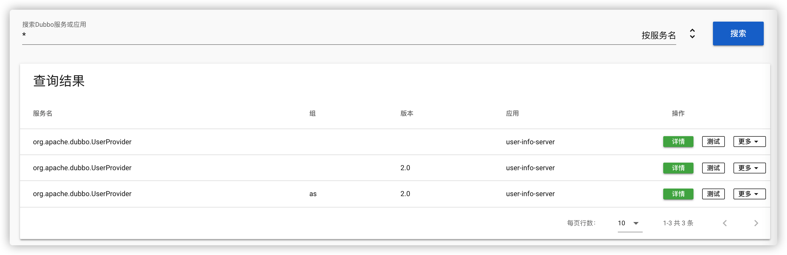

鉴于我司java技术栈为主这个事实，go作为小众，为了使用公司的[dubbo](https://dubbo.apache.org/zh/)基础设施，只有三条路可以走：
1. 让dubbo应用开发者提供http协议接口(你确定别人愿意花额外的时间干这件事？)，此路不通；
2. 自己用java开发一个http网关，将dubbo接口以http方式暴露出来，也不是不行，但java真的不熟，要是熟，也就不必开发这个网关了；
3. 直接使用go开发dubbo接口的consumer，[dubbogo](https://github.com/apache/dubbo-go/blob/master/README_CN.md)支持这种方式

虽然不是一个绝对的外行，但对于dubbo的一些基本概念还是要理清楚的，一图胜千言


1. 通常[zk](https://zookeeper.apache.org/)作为图中的Registry，为服务发现之中
2. Provider自然就是java提供的dubbo接口了
3. Consumer就是go写的dubbo调用方了

dubbogo是dubbo的golang实现，由此我们可以使用go作为Consumer，调用java写的dubbo接口方法，为了方便观察，我在本地启动了一个dubbo-server、zk以及[dubbo-admin](https://github.com/apache/dubbo-admin/blob/develop/README_ZH.md)

docker-compose配置如下所示：
```yml
# refer:https://github.com/apache/dubbo-admin/blob/develop/docker/stack.yml
version: '3'

services:
  zookeeper:
    image: zookeeper
    ports:
      - 2181:2181
  admin:
    image: apache/dubbo-admin:0.3.0
    depends_on:
      - zookeeper
    ports:
      - 8080:8080
    environment:
      - admin.registry.address=zookeeper://zookeeper:2181
      - admin.config-center=zookeeper://zookeeper:2181
      - admin.metadata-report.address=zookeeper://zookeeper:2181
```
用IDEA启动dubbo-server端：https://github.com/apache/dubbo-go-samples/tree/master/generic/java-server/2.7，记住项目编译版本一定要选择java8(不要问了怎么知道的)，打开dubbo-admin（用户名密码均为:root），此时可以顺利看到服务注册信息



这说明dubbo服务端启动成功且成功将自身信息注册到了zk，下一步我们启动go客户端：https://github.com/apache/dubbo-go-samples/tree/master/generic/go-client
```
CONF_CONSUMER_FILE_PATH=conf/client.yml go run cmd/client.go
```
没有明显的报错，我们可以调用是成功的，如果你有注意到IDEA这边的日志，可以发现go客户端的调用确实是成功的，问题在于dubbo-admin这里的信息发生了变化


从现象看就是go consumer的注册信息“覆盖”了java provider的信息，当然，这是表象，如果真的覆盖，go consumer的调用不可能成功的，我们查看一下zk里面的注册信息
```bash
[zk: localhost:2181(CONNECTED) 2] ls /
[dubbo, zookeeper]
```
看看dubbo目录
```bash
[zk: localhost:2181(CONNECTED) 3] ls /dubbo
[config, org.apache.dubbo.UserProvider]
```
进到UserProvider中
```
[zk: localhost:2181(CONNECTED) 7] ls /dubbo/org.apache.dubbo.UserProvider
[configurators, consumers, providers, routers]
```
查看providers
```
[zk: localhost:2181(CONNECTED) 8] ls /dubbo/org.apache.dubbo.UserProvider/providers
[dubbo%3A%2F%2F192.168.199.182%3A20010%2Forg.apache.dubbo.UserProvider%3Fanyhost%3Dtrue%26application%3Duser-info-server%26deprecated%3Dfalse%26dubbo%3D2.0.2%26dynamic%3Dtrue%26generic%3Dfalse%26group%3Das%26interface%3Dorg.apache.dubbo.UserProvider%26methods%3DGetErr%2CGetUserMap%2CgetUser%2CCalc%2CSum%2CGetUsers%2CGetUser3%2CqueryAll%2CGetUser0%2CisLimit%2CqueryUser%2CGetUser%26pid%3D83008%26release%3D2.7.7%26revision%3D2.0%26side%3Dprovider%26timeout%3D3000%26timestamp%3D1631543281615%26version%3D2.0, dubbo%3A%2F%2F192.168.199.182%3A20010%2Forg.apache.dubbo.UserProvider%3Fanyhost%3Dtrue%26application%3Duser-info-server%26deprecated%3Dfalse%26dubbo%3D2.0.2%26dynamic%3Dtrue%26generic%3Dfalse%26interface%3Dorg.apache.dubbo.UserProvider%26methods%3DGetErr%2CGetUserMap%2CgetUser%2CCalc%2CSum%2CGetUsers%2CGetUser3%2CqueryAll%2CGetUser0%2CisLimit%2CqueryUser%2CGetUser%26pid%3D83008%26release%3D2.7.7%26revision%3D2.0%26side%3Dprovider%26timeout%3D3000%26timestamp%3D1631543281714%26version%3D2.0, dubbo%3A%2F%2F192.168.199.182%3A20010%2Forg.apache.dubbo.UserProvider%3Fanyhost%3Dtrue%26application%3Duser-info-server%26deprecated%3Dfalse%26dubbo%3D2.0.2%26dynamic%3Dtrue%26generic%3Dfalse%26interface%3Dorg.apache.dubbo.UserProvider%26methods%3DGetErr%2CGetUserMap%2CgetUser%2CCalc%2CSum%2CGetUsers%2CGetUser3%2CqueryAll%2CGetUser0%2CisLimit%2CqueryUser%2CGetUser%26pid%3D83008%26release%3D2.7.7%26side%3Dprovider%26timeout%3D3000%26timestamp%3D1631543280655]
```
可以看到java provider的信息完好无损，在git上找到一条关联[issue](https://github.com/apache/dubbo-go/issues/1198)，结论是：dubbo-admin展示逻辑问题，所以dubbogo目前为止可用，但是在dubbo-admin上的注册信息显示有问题，目前这个我还没有解决，毕竟dubbo-admin上可以在线调试dubbo接口，如果因为dubbo-go的调用而更改了注册信息，这也太不友好了，目前对dubbo-go的评价：能用！


