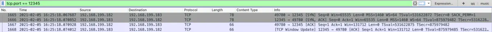
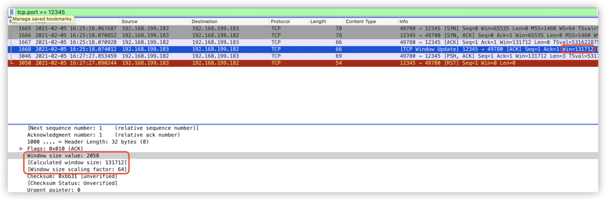
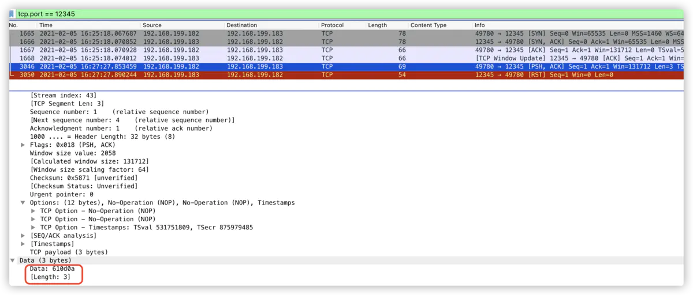

## 什么是半开连接？
众所周知，TCP三次握手完成才能认为是双方建立起连接，温故而知新，先回顾一下三次握手的过程


如果连接建立后不再进行任务数据交互的话，服务端直接挂了，比如断网宕机了，此时客户端是无法与服务端通信的，但是客户端并不知道这件事，此时这条TCP连接就可以认为是半开连接，还是来一条书本的定义吧：
> 如果在未告知另一端的情况下通信的一端关闭或是终止连接，那么就认为该条TCP连接处于半开状态

## wireshark抓包
 服务端开启动一个server如下所示：
```
➜ python3 -m http.server  12345
```
客户端向服务端发起请求
```
➜ telnet 192.168.199.183 12345
```
客户端启用wireshark监听`12345`端口


1665、1666、1667三个数据包完成握手，已知1666号包服务端的[SYN, ACK]包中，服务端告知客户端自己的窗口大小为**65535**


而1668号包**[TCP Window Update]**:
服务端告知客户端窗口大小为**131712**（即2058*64）


服务端窗口变大了，这属于滑动窗口相关内容，此处就不作展开了

## 服务端重启
服务端断网杀掉server，重开一个server，如之前的一样
```
➜ python3 -m http.server  12345
```
此时客户端输入字符`a`然后回车，所图3046号包所示



***此时服务不再记得之前的这条连接***，所以回了一个[RST]报文如下所示：


## 原因分析
系统用一个4四元组来唯一标识一个TCP连接，即[src_ip:src_port, dst_ip:dst_port]，从我所构造的这个半开连接抓包杨景来看，这四元组是没有发生变化的，那么问题来了：服务端如何判断是否与客户端建立起连接?
回到我们所构造的场景
1. 服务端启动server
2. 客户端发起连接
3. 服务器断网杀掉并启动一个server，监听相同的端口
4. 客户端发送数据
5. 服务端返回RST

我们知道三次握手后server端会维护一个accept队列(当然还有SYN队列)，我们的构造的情况是server杀掉重开，虽然端口一样，但这是一个新的进程，此时accept队列自然为空，所以当客户端向这个相同ip及端口的server发送数据据，服务端自然不能识别这个连接。

---
不过，这个分析只是基于现象进行的推理，具体处理过程恐怕还得从socket连接及I/O过程及程序代码说起，先开个坑，欲知详情如何，且听下回分解

参考：
- [TCP/IP详解 卷1：协议](https://book.douban.com/subject/1088054/)
- [TCP 的那些事儿（上）](https://coolshell.cn/articles/11564.html)
