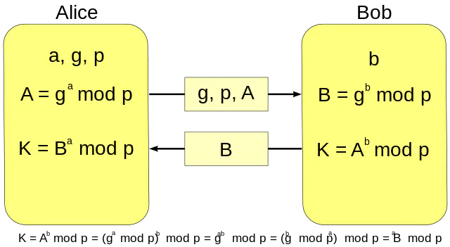
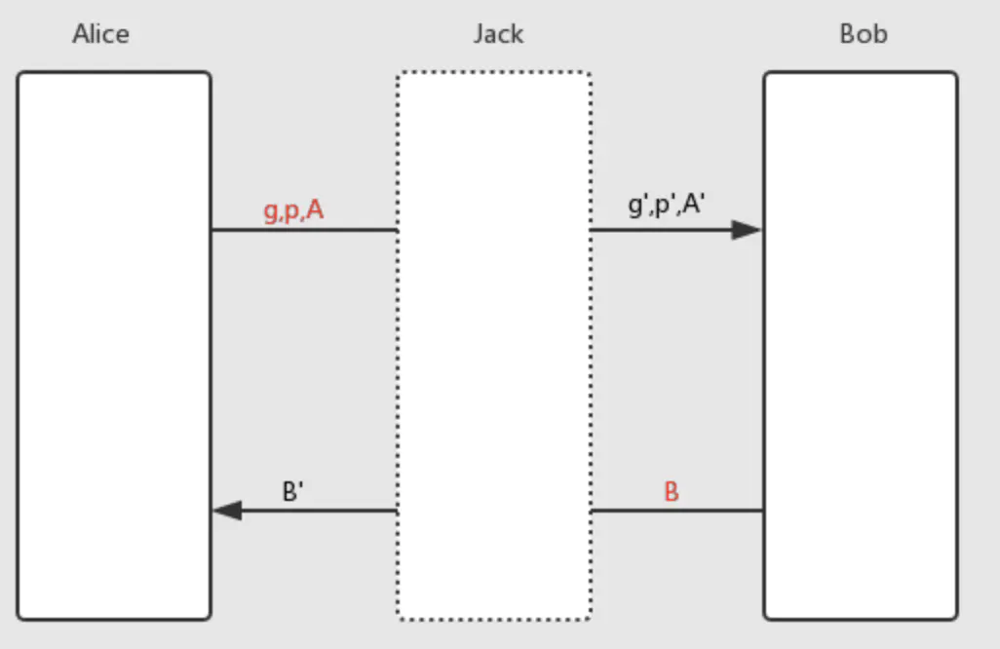

作为一名coder，平时工作中真正用到数学公式的机会其实并不多，而且因为工作内容以CRUD为主，本质上是在做数据的提取与组装，很少有用到数学公式的机会，更遑论感受数学之美了（说起来当年考研数学分数高出英语不到10分，要知道数学总分150，英语总分100，不提了，说起来都是泪），直到我研究[HTTPS协议](https://zh.wikipedia.org/wiki/%E8%B6%85%E6%96%87%E6%9C%AC%E4%BC%A0%E8%BE%93%E5%AE%89%E5%85%A8%E5%8D%8F%E8%AE%AE)时，看到Diffie–Hellman密钥交换协议，真是惊为天人，第一次感觉到了数学之美，持续数年之久，于今日成文。

## 什么是Diffie–Hellman密钥交换?
>它可以让双方在完全没有对方任何预先信息的条件下通过不安全信道创建起一个密钥。这个密钥可以在后续的通讯中作为对称密钥来加密通讯内容。

盗图一张

## 神奇之处
数学公式看着是容易让人头疼的，不过简单来讲就是
1. Alice与Bob两人要协定一个只有两人知道的共享密钥
2. Alice公开`g`、`p`、`A`三个数并提供给Bob
3. Bob公开`B`并提供给Alice
4. 由此Alice与Bob通过计算可以得到相同的值`K`，作为共享密钥，就算知道这个数学公式，但是通过公开的`g`、`p`、`A`、`B`却难以计算出`a`

## 中间人攻击 
一切看起来似乎很美好，不过前面有提到**不安全信道**，这种方式难以防止中间人攻击

Alice的网络被Jack监听，Alice跟Bob的交互都要先通过Jack，于是Jack就可以将`g`、`p`、`A`伪造成`g'`、`p'`、`A'`（为什么要伪造呢，因为Jack目前还不知道Bob私有的数据`b`），Jack伪装成Alice与Bob通信，同理，得到Bob的数据`B`，然后伪造新的数据`B'`返回给Alice；所以此时其实共享密钥**K**其实有两个值，Alice与Jack共享的K1以及Jack与Bob共享的K2，此时Jack作为中间人，就可以窃取Alice与Bob的通讯记录了：
1. Alice发送使用K1加密后的数据M
2. Jack得到M, 使用K1解密，然后使用K2加密成M'
3. Jack将M'发送给Bob
4. Bob给Alice发送数据同上

虽然通信信道被窃听，但是双方是无感知的，这就是中间人攻击。

参考：
- [迪菲-赫尔曼密钥交换维基百科](https://zh.wikipedia.org/wiki/%E8%BF%AA%E8%8F%B2-%E8%B5%AB%E7%88%BE%E6%9B%BC%E5%AF%86%E9%91%B0%E4%BA%A4%E6%8F%9B)
- [中间人攻击](https://zh.wikipedia.org/wiki/%E4%B8%AD%E9%97%B4%E4%BA%BA%E6%94%BB%E5%87%BB)
